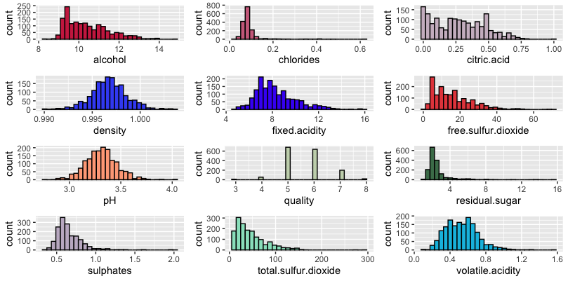

```{r warning=FALSE, include=F, paged.print=TRUE}
suppressMessages(library(dplyr))
suppressMessages(library(readxl))
suppressMessages(library(tidyverse))
suppressMessages(library(FactoMineR))
suppressMessages(library(factoextra))
suppressMessages(library(foreign))
suppressMessages(library(corrplot))
suppressMessages(library(polycor))
suppressMessages(library(psych))
suppressMessages(library(gplots))
suppressMessages(library(gridExtra))
suppressMessages(library(viridis))
suppressMessages(library(lsr))
suppressMessages(library(DescTools))
suppressMessages(library(magrittr))
suppressMessages(library(nlme))
suppressMessages(library(MASS))
suppressMessages(library(multilevel))
suppressMessages(library(reshape))
suppressMessages(library(homals))
suppressMessages(library(GGally))
suppressMessages(library(CCA))
suppressMessages(library(plotly))
suppressMessages(library(broom))
suppressMessages(library(readr))
suppressMessages(library(readxl))
suppressMessages(library(MASS))
suppressMessages(library(VGAM))
```

# Introducción 

El presente trabajo tiene como finalidad ajustar un Modelo Logístico, para un conjunto de datos de vino tinto que consta de 1599 observaciones y 12 variables, 11 de las cuales son sustancias químicas. 

```{r warning=FALSE, include=F, paged.print=TRUE}
Datos <- read.table("Datos.txt",header=T,sep = ",")
Datos
```
```{r warning=FALSE, include=T, paged.print=TRUE}
dim(Datos)
```

Las variables son:

1. **Acidez fija:** La mayoría de los ácidos implicados en el vino son fijos o no volátiles (no se evaporan fácilmente).

2. **Acidez volátil:** La cantidad de ácido acético en el vino, que en niveles demasiado altos puede provocar un sabor desagradable a vinagre.

3. **Ácido cítrico:** Encontrado en pequeñas cantidades, el ácido cítrico puede agregar "frescura" y sabor a los vinos.

4. **Azúcar residual:** Es la cantidad de azúcar que queda después de que se detiene la fermentación, es raro encontrar vinos con menos de 1 gramo / litro y los vinos con más de 45 gramos / litro se consideran dulces.

5. **Cloruros:** Es la cantidad de sal del vino.

6. **Dióxido de azufre libre:** La forma libre de $SO_{2}$ existe en equilibrio entre el $SO_{2}$ molecular (como gas disuelto) y el ion bisulfito; Previene el crecimiento microbiano y la oxidación del vino.

7. **Dióxido de azufre total:** Es la cantidad de formas libres y unidas de $SO_{2}$; en concentraciones bajas, el $SO_{2}$ es mayormente indetectable en el vino, pero en concentraciones de $SO_{2}$ libre superiores a 50 ppm, el $SO_{2}$ se hace evidente en la nariz y el sabor del vino.

8. **Densidad:** La densidad es cercana a la del agua dependiendo del porcentaje de alcohol y contenido de azúcar.

9. **pH:** Describe qué tan ácido o básico es un vino en una escala de 0 (muy ácido) a 14 (muy básico); la mayoría de los vinos están entre 3-4 en la escala de pH.

10. **Sulfatos:** Aditivo del vino que puede contribuir a los niveles de dióxido de azufre $(SO_{2})$, que actúa como antimicrobiano y antioxidante.

11. **Alcohol:** El porcentaje de contenido de alcohol del vino.

12. **Calidad:** Variable de respuesta (basada en datos sensoriales, puntuación entre 0 y 10).

<div/>

### Estadísticas descriptivas

```{r warning=FALSE, include=T, paged.print=TRUE}
summary(Datos)
```

<center>
{width=650px}

### Observaciones

* Algunas de las variables tienen distribuciones normales (densidad, acidez fija, pH, acidez volátil).

* Algunas variables están un poco sesgadas hacia el extremo inferior de los valores (cloruros, ácido cítrico, azúcar residual, dióxido de azufre total).

* La variable calidad tiene solo 6 valores discretos.

### Correlación

```{r fig.align="center", fig.height=4, fig.width=10, warning=FALSE, include=T}
corrplot(cor(Datos), method="square", type="upper", order="hclust", tl.col="black")
```

* La densidad tiene una correlación muy fuerte con la acidez fija.

* Las variables más fuertemente correlacionadas con la calidad son la acidez volátil y el alcohol.

* El alcohol tiene una correlación negativa con la densidad. Esto es evidente por el hecho de que la densidad del agua es mayor que la densidad del alcohol.

* Es posible observar que las variables pH y acidez fija presentan una correlación negativamente fuerte, lo cual nos indica que a mayor pH menor será la acidez, y viceversa, a menor pH mayor acidez. Lo cual se ve reflejado en la calidad final del vino.

# Muestra
Se elige una muestra de mil doscientos $(1200)$ vinos de esta base de datos y trabaje, tal como sigue:

```{r warning=FALSE, include=T, paged.print=TRUE}
#Tamaño de la muestra
n <- 1200
```

```{r warning=FALSE, include=F, paged.print=TRUE}
#Selección de la muestra
set.seed(123)
library(dplyr)
muestra <- Datos %>% sample_n(size=n,replace=FALSE)
muestra
```

### Variable indicadora: alcoholAB

Se convierte la variable "alcohol" en una variable indicadora con dos niveles: "bajo" y "alto", esta nueva variable se denomina: "alcoholAB".

```{r warning=FALSE, include=T, paged.print=TRUE}
# Variable indicadora alcoholAB
alcoholAB <- vector() 
alcoholAB[muestra$alcohol < 12] <- "Bajo"
alcoholAB[muestra$alcohol >= 12] <- "Alto"
alcoholAB <- as.factor(alcoholAB)
table(alcoholAB)
```

```{r fig.align="center", fig.height=4, fig.width=5, warning=FALSE, include=T}
G2 <- ggplot(data = muestra, aes(x=alcoholAB, fill=alcoholAB)) +
  geom_bar(position="dodge") + ylab("") + xlab(" ") +
  scale_fill_discrete(name = "alcohol:") + scale_fill_brewer(palette="Dark2") +
  theme(legend.position="bottom")
G2
```

## Variables dicotomica: calidadAB

Se convierte la variable "calidad" (quality) en una variable dicotómica y se denomina "calidadAB". Se forma un grupo con los vinos que tienen calidades 7 y 8 y otro con los demás vinos.

```{r warning=FALSE, include=T, paged.print=TRUE}
# Variable indicadora quality
calidadAB <- vector()
calidadAB[muestra$quality <= 6] <- "0"
calidadAB[muestra$quality > 6] <- "1"
calidadAB <- as.factor(calidadAB)
table(calidadAB)

```

```{r fig.align="center", fig.height=4, fig.width=5, warning=FALSE, include=T}
G3 <- ggplot(data = muestra, aes(x=calidadAB, fill=calidadAB)) +
  geom_bar(position="dodge") + ylab("") + xlab(" ") +
  scale_fill_discrete(name = "Calidad:") + scale_fill_brewer(palette="Set1") +
  theme(legend.position="bottom")
G3
```
# Modelo logístico con variable indicadora

Para ajustar este modelo se hace uso de la función glm() para modelos lineales generalizados, una clase de modelos en los que se incluye el modelo logístico. En nuestro caso, se ajusta un modelo lineal generalizado usando como respuesta la variable calidadAB y como variables de predicción las variables "acidez fja" (fixed acidity) y "alcoholAB". Además, como la variable de respuesta "calidadAB" es una variable dicotómica especificamos el argumento family = binomial.

```{r warning=FALSE, include=T, paged.print=T}
Modelo<- glm(calidadAB ~ fixed.acidity + alcoholAB + fixed.acidity*alcoholAB, data = muestra, family = "binomial")
```

```{r warning=FALSE, include=T, paged.print=F}
summary(Modelo)
```


El modelo obtenido es el siguiente:

$$calidadAB= -0.23257+ 0.01305*Acidez fija+-3.88183*AlcoholAB Bajo +0.22169*Acidez fija*AlcoholABBajo$$

A partir de los anteriores resultados y teniendo en cuenta que la interpretación de los p-valores es similar a la del modelo lineal. Es posible evidenciar que la variable alcoholAB-Bajo es altamente significativa $(2.7e-06)$. De igual forma, la interacción entre ambas varias explicativas acidez fija y alcoholABBajo es significativa $(0.0232)$

Respecto a la interpretación de los coeficientes del modelo logit, estos se interpretan como el logaritmo del odds ratio. Así, si nos fijamos en el coeficiente de la variable acidez fija (0.01305), está positivamente relacionada con el logaritmo del odds ratio de la calidadAB del vino, la cual aumentaría 0.01305 unidades por cada unidad que aumenta la acidez fija. Por otro lado, la variable alcoholABBajo se encuentra negativamente relacionada con el logaritmo del odds ratio de la calidadAB del vino, el cual disminuiría -3.88183 unidades por cada unidad que aumenta el alcoholABBajo.


# Bibliografía

+ Fox, J. (2015),Applied regression analysis and generalized linear models, SagePublications.
- Dobson, A. J., & Barnett, A. G. (2018). An introduction to generalized linear models. CRC press.